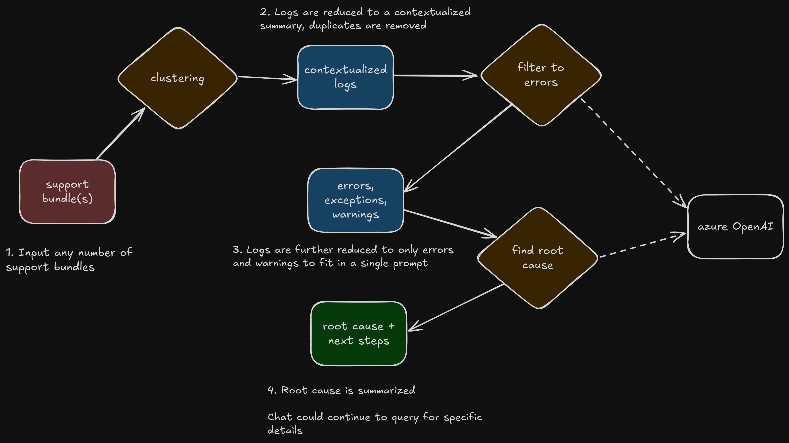

# LLM based support bundle analyzer



## Getting started

```bash
# Setup your env with poetry
curl -sSL https://install.python-poetry.org | python3 -

# Install packages
./sync_dependencies.sh

# Config
export AZURE_OPENAI_API_KEY=<your key>
export AZURE_OPENAI_ENDPOINT=<your url>
export AZURE_DEPLOYMENT_NAME=<deployment>

# Run
poetry run console <support bundle zip> [--verbose]
```

## Flow

1. Clusters the logs to reduce them down since it can't send them all in the prompt
1. Creates an ID for each cluster and sends those to the LLM and asks it give back the list of IDs of only failure messages
1. Filters down to those IDs
1. Add context about which pod the error came from, occurrences, timestamp ranges
1. Sends those messages with context to the LLM and asks for a summary
